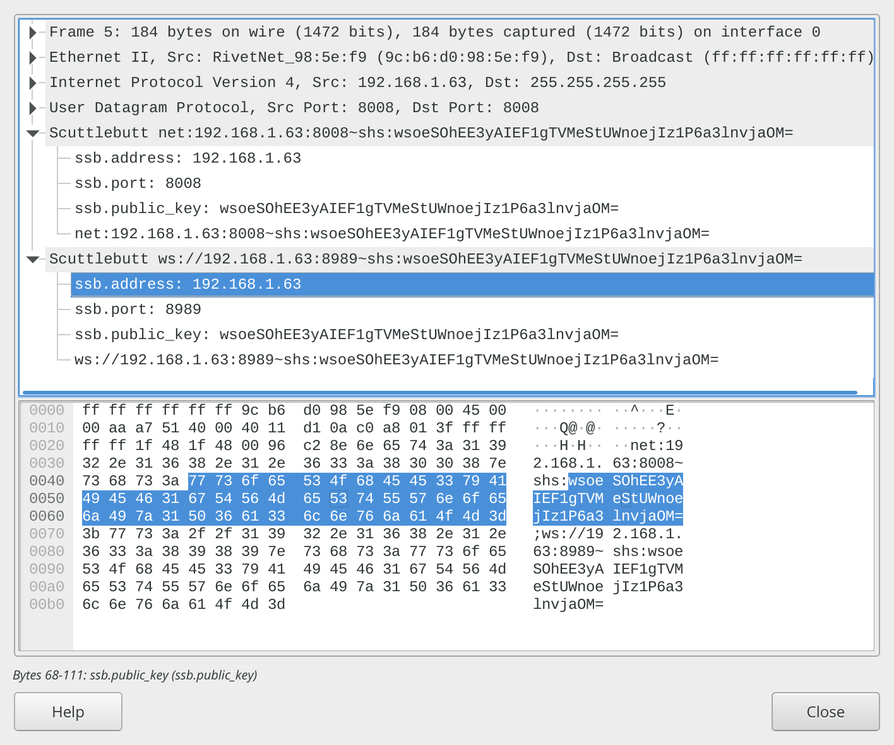

After copying it to the plugins folder, restart wireshark, begin a network capture on whatever interface makes sense for you, and you can filter out the protocol by typing ssb in the filter bar.

Then you can click on a packet and explore like normal.

There are definitely improvements to be made if you wanna hack around, like capturing the protocol, maybe reorganizing how multiple advertisements are shown. Its a small script.

